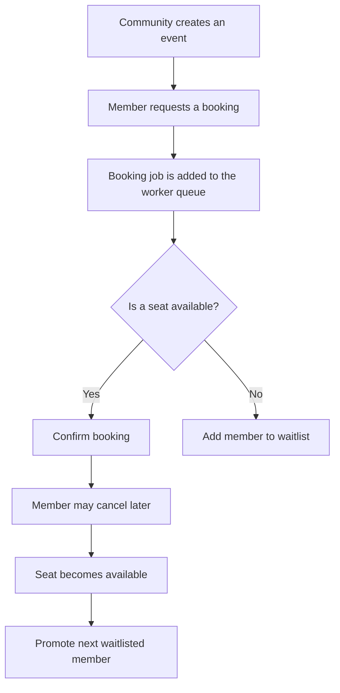

# Community Event Booking System

A backend system where communities create events with limited seats, members request bookings, and the system manages confirmations, waitlists, cancellations, and automatic seat promotion.

## Overview

The Community Event Booking System is a production-style backend project built with Go.

Communities can create events with a fixed number of seats. Members can request a seat for an event. Each request is processed asynchronously by a background worker.

If a seat is available, the booking is confirmed. If the event is full, the member is added to a waitlist. When a confirmed member cancels, the system automatically promotes the next eligible person from the waitlist.

The project is designed to demonstrate how database transactions, background workers, Redis caching, context handling, graceful shutdown, structured logging, testing, and deployment work together in one backend system.

## Main Flow



## Core Features

- JWT-based authentication
- Community management
- Community membership management
- Event creation with seat limits
- Asynchronous booking processing
- Transaction-safe seat allocation
- Redis-cached seat availability
- Automatic waitlist management
- Automatic promotion after cancellation
- Pagination on list endpoints
- Rate limiting on the booking endpoint
- Structured logging with `slog`
- Context propagation and timeouts
- Graceful shutdown with worker draining
- Centralised error handling
- CORS middleware
- System statistics endpoint
- Integration tests
- Docker support
- GitHub Actions CI/CD
- Cloud deployment

## How Booking Works

A booking request does not immediately guarantee a seat.

1. A member requests a seat for an event.
2. The API creates a booking job.
3. A background worker processes the job.
4. A database transaction checks the current seat availability.
5. The member is either:
   - confirmed, or
   - added to the waitlist.
6. If a confirmed member cancels, the next waitlisted member is promoted automatically.

This approach helps the system safely handle multiple booking requests arriving at the same time.

## Why Transactions Are Important

Imagine an event has only one seat remaining and two members request it at the same time.

Without transaction protection, both members could incorrectly receive the final seat.

Database transactions ensure that seat allocation remains correct and that an event never confirms more members than its allowed capacity.

## Why Redis Is Used

PostgreSQL remains the source of truth for bookings and seat allocation.

Redis is used to cache seat availability so the system can answer availability requests quickly without querying the database every time.

The cache must be updated or invalidated whenever a booking is confirmed, cancelled, waitlisted, or promoted.

## Planned Statistics Endpoint

The `/stats` endpoint will provide information such as:

- Total communities
- Total events
- Total bookings
- Total waitlisted members
- Cache status

## Technology Stack

- **Language:** Go
- **HTTP Framework:** Gin
- **Database:** PostgreSQL
- **Database Library:** sqlx
- **Database Migrations:** golang-migrate
- **Authentication:** golang-jwt
- **Caching:** Redis
- **Logging:** slog
- **Containerisation:** Docker
- **CI/CD:** GitHub Actions

## Project Structure

The final project structure may look similar to this:

```text
community-event-booking-system/
├── cmd/
│   └── api/
├── internal/
│   ├── auth/
│   ├── community/
│   ├── event/
│   ├── booking/
│   ├── waitlist/
│   ├── worker/
│   ├── middleware/
│   ├── database/
│   ├── cache/
│   └── platform/
├── migrations/
├── tests/
├── Dockerfile
├── docker-compose.yml
├── go.mod
└── README.md
```

The structure will evolve as the system is designed and implemented.

## Project Status

This project is currently in development.

### Planned Milestones

- [ ] Define requirements and system boundaries
- [ ] Design database schema
- [ ] Create migrations
- [ ] Implement authentication
- [ ] Implement communities and memberships
- [ ] Implement event management
- [ ] Design booking states
- [ ] Build asynchronous booking worker
- [ ] Add transaction-safe seat allocation
- [ ] Implement waitlist promotion
- [ ] Add Redis caching
- [ ] Add rate limiting
- [ ] Add structured logging
- [ ] Add graceful shutdown
- [ ] Add statistics endpoint
- [ ] Write integration tests
- [ ] Add Docker setup
- [ ] Configure GitHub Actions
- [ ] Deploy to the cloud

## Learning Goals

This project focuses on building a backend system where multiple components work together correctly.

The main learning goals are:

- Designing clear system boundaries
- Protecting shared data from race conditions
- Using transactions for business-critical operations
- Processing work asynchronously
- Managing booking states
- Keeping cache and database data consistent
- Shutting down workers safely
- Writing meaningful integration tests
- Building a complete CI/CD workflow
- Deploying a production-style backend service

## Module Path

```text
github.com/deeep8250/community-event-booking-system
```

## Running the Project

Setup and execution instructions will be added as the implementation progresses.

The expected local development flow will use Docker Compose to run:

- Go API
- PostgreSQL
- Redis

## Testing

The project will include integration tests for the most important business flows:

- Booking confirmation when a seat is available
- Waitlisting when an event is full
- Cancellation of a confirmed booking
- Automatic promotion from the waitlist
- Protection against overbooking

## License

This project is created for learning and portfolio purposes.
